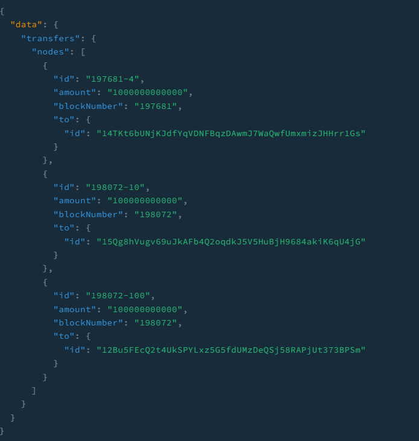

# What is SubQuery?

SubQuery powers the next generation of Polkadot dApps by allowing developers to extract, transform and query blockchain data in real time using GraphQL. In addition to this, SubQuery provides production quality hosting infrastructure to run these projects in.

# SubQuery Example - Account transfers

This subquery example indexes the amount transferred of each account and it is an example of a 1-many entity relationshp. In other words, one account can have many receiving addresses.

# Getting Started and Result

### 1. Example query to run

```shell
query{
  transfers(first: 3){
    nodes{
      id
      amount
      blockNumber
      to{
        id
      }
      }
    }
  }
```
### 2. Result

# tutorials-accounts-transfer
